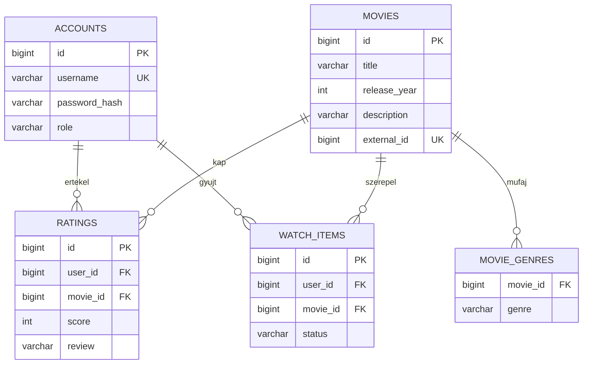

# MovieClub – műszaki dokumentáció

## Feladat és megvalósított terjedelem

A kapott 17. sor alapján:
- **Projekt:** MovieClub.
- **Feladat:** filmklub filmekkel, értékelésekkel és nézési listákkal.
- **1. heti MVP:** filmlista, értékelés és saját nézési lista.
- **Komplex funkció:** személyre szabott ajánlás.
- **Kritikus szabályok:** csak ismert filmek ajánlhatók; felhasználónként és filmenként egy értékelés.
- **Szerepkörök:** tag és moderátor.
- **Külső integráció:** filmes metaadat-API, konkrétan TMDB.

Az „ismert film” a helyi adatbázisban szereplő filmet jelenti. Egy értékelés szerkeszthető vagy törölhető, de egyszerre csak egy értékelés tartozhat ugyanahhoz a felhasználó–film párhoz. Értékelés mentése nem jelöli automatikusan megnézettnek a filmet, de az ajánló mindkét feltételt külön figyeli.

## Technológiai döntések

Java 21, Spring Boot 3.5.16, Maven 3.9.11, Spring MVC, Spring Security, Spring Data JPA/Hibernate, H2, Liquibase, Thymeleaf, JUnit 5, Mockito és MockMvc.

A Spring Boot beépített Tomcatet használ. A Thymeleaf a közös HTML-oldalvázat szolgálja ki; a böngésző egyszerű JavaScriptje ugyanennek az alkalmazásnak a REST-végpontjait hívja. Nincs külön frontend-fordítás, Node.js vagy npm.

Ez egy MVC-alapú Spring alkalmazás REST-adatkezeléssel. A Thymeleaf nem rendereli szerveroldalon a teljes filmkatalógust; a dinamikus felületrészeket a REST-válaszokból a JavaScript építi fel. JSP-t és kézzel írt servletet nem tartalmaz.

### Maven-modulok és függőségek

```text
movieclub (szülő POM)
├── movieclub-core
│   ├── Movie, Rating, Account, WatchItem
│   ├── ClubStore és MetadataProvider interfészek
│   └── RecommendationService
├── movieclub-infrastructure → core
│   ├── JPA-entitások és Spring Data repositoryk
│   ├── JpaClubStore adapter
│   ├── TmdbMetadataProvider
│   └── Liquibase-változások
└── movieclub-web → infrastructure → core
    ├── alkalmazásindítás, konfiguráció
    ├── REST-vezérlők, bemenetellenőrzés
    ├── Spring Security, demóadatok
    └── HTML, CSS, JavaScript
```

A core éles függőségei között nincs Spring vagy adatbáziskezelő. Az ajánló a ClubStore interfészt ismeri. A JPA-adapter cserélhető, a tesztben pedig Mockito adja az adatait.

### SOLID – konkrét példák

- **S:** a RecommendationService ajánl, a TmdbMetadataProvider távoli adatokat kér, a JpaClubStore ment és olvas.
- **O:** új MetadataProvider-megvalósítás készíthető a vezérlő üzleti felületének módosítása nélkül.
- **L:** a ClubStore szerződését a valódi JPA-adapter és a tesztbeli helyettesítés is teljesíti.
- **I:** a külső adatforrás külön MetadataProvider interfészt kapott; nem része az adatbázistároló szerződésének.
- **D:** az ajánló a ClubStore absztrakciójától függ, és konstruktoron kapja meg a megvalósítást.

A ClubStore tudatosan kisprojekt-méretű, összefogó tárolóport; nagyobb rendszerben több célzott interfészre bontható.

## Adatmodell



- A műfajok az egyszerűség kedvéért a filmhez tartozó szöveges halmazt alkotnak, külön kapcsolótáblában.
- A ratings és watch_items táblákon egyedi (user_id, movie_id) kulcs van.
- A pontszámot adatbázis CHECK is 1–5 között tartja.
- A külső filmes azonosító egyedi: ugyanaz a TMDB-film többször nem importálható.
- Film törlésekor az értékelések, műfajkapcsolatok és listabejegyzések is törlődnek.
- A JPA nem generál sémát; a Liquibase hozza létre, a Hibernate csak ellenőrzi.

## Ajánlórendszer

1. Beolvassa a helyi katalógust, az értékeléseket és a felhasználó listáját.
2. Kizárja a felhasználó által már értékelt és WATCHED állapotú filmeket.
3. A PLANNED állapotú film ajánlható marad.
4. A 4–5 csillagra értékelt filmek műfajai pontokat kapnak: 4 csillagnál 1, 5 csillagnál 2 pontot.
5. Egy jelölt film műfaji pontszáma az egyező műfajok pontjainak összege.
6. A közösségi érték számítása: **(pontszámok összege + 15) / (szavazatok száma + 5)**. Ez öt képzeletbeli, 3 csillagos szavazattal simítja a kevés adatot.
7. A végső rangsorpont: **2 × műfaji pont + simított közösségi érték**.
8. Csökkenő pontszám, majd cím és azonosító szerint rendez, legfeljebb 12 filmet ad vissza.

A rangsorpont belső ajánlási érték, nem 1–5 csillagos átlag. A katalógus külön a valódi értékelések egyszerű számtani átlagát mutatja.

Kevés személyes adatnál közösségi rangsor adja a kiindulást. A magyarázat determinisztikus, nincs LLM-hívás. Az API-ból érkező filmek csak importálás után kerülnek az ajánló jelöltjei közé.

## Biztonság és hibakezelés

- Session-alapú bejelentkezés, BCrypt-jelszóhash.
- CSRF-védelem minden állapotmódosító kérésen, a belépésen és a regisztráción is.
- A /api/session az aktuális CSRF-token mellett csak a szükséges profiladatokat adja vissza.
- A regisztráló mindig MEMBER; szerepkört nem fogadunk el a kérésben.
- A nézési lista tulajdonosa a bejelentkezett felhasználóból származik, nem a kérésben küldött userId-ból.
- Más értékelését tag nem törölheti. A moderátor törölhet, de nem írhatja át más véleményét.
- A /api/moderator/** végpontokat a Spring Security szerveroldalon védi.
- A kliens minden felhasználói szöveget HTML-escape után jelenít meg.
- A bemeneti DTO-k Bean Validation szabályokat használnak; az ismeretlen JSON-mezők hibát eredményeznek.
- Hibák: 400 hibás adat, 401 bejelentkezés szükséges, 403 tiltott művelet/CSRF, 404 nem létező film, 409 ütközés, 503 külső szolgáltatási hiba.
- CORS nincs megnyitva: a felület és az API azonos eredetről fut.
- Az alkalmazás alapértelmezetten csak a helyi gépre figyel.

## REST-végpontok

| Metódus és útvonal | Funkció | Hozzáférés |
|---|---|---|
| GET /api/session | Profil és CSRF-token | Nyilvános |
| POST /api/register | Regisztráció | Nyilvános, CSRF |
| POST /api/login | Űrlapos belépés | Nyilvános, CSRF |
| POST /api/logout | Kilépés | Bejelentkezett, CSRF |
| GET /api/movies?q=&genre= | Katalógus és szűrés | Nyilvános |
| GET /api/movies/{id} | Film és értékelések | Nyilvános |
| PUT /api/movies/{id}/rating | Saját értékelés létrehozása/frissítése | Tag |
| DELETE /api/ratings/{id} | Saját értékelés vagy moderátori törlés | Tag/moderátor |
| GET /api/watchlist | Saját lista | Tag |
| PUT /api/watchlist/{id} | PLANNED/WATCHED állapot mentése | Tag |
| DELETE /api/watchlist/{id} | Levétel a saját listáról | Tag |
| GET /api/recommendations | Személyes ajánlások | Tag |
| POST /api/moderator/movies | Új film | Moderátor |
| PUT /api/moderator/movies/{id} | Film szerkesztése | Moderátor |
| DELETE /api/moderator/movies/{id} | Film és kapcsolódó adatok törlése | Moderátor |
| GET /api/moderator/import/search?q= | TMDB-keresés | Moderátor |
| POST /api/moderator/import/{id} | TMDB-film importálása | Moderátor |

A mutáló API-végpontok CSRF-fejlécet is igényelnek. A login application/x-www-form-urlencoded adatot, a többi adatot fogadó művelet JSON-t vár.

Példa értékelés: `{"score":5,"review":"Nagyon tetszett."}`

Példa listaállapot: `{"status":"PLANNED"}`

## Tesztelés

- **RecommendationServiceTest:** 6 JUnit 5 + Mockito unit teszt.
- **ClubIntegrationTest:** 18 teljes Spring-környezetes MockMvc/adatbázis teszt; valódi Liquibase és memóriabeli H2, tesztenként visszagörgetett tranzakciók.
- **TmdbMetadataProviderTest:** 3 HTTP-komponens teszt helyi tesztszerverrel.

A tesztek külső hálózat és TMDB-token nélkül futnak, a függőségek letöltését követően. A kimenet a modulok target/surefire-reports mappájában található.

## Tantárgyi lefedettség

| Téma | Hol jelenik meg? |
|---|---|
| SOLID | Interfészek, konstruktoros injektálás, elkülönített ajánló és adapterek |
| Maven multi-module | Szülő POM és három modul |
| JUnit 5, Mockito | Core tesztek |
| MVC, Tomcat | Spring MVC + beépített Tomcat |
| Spring alapok | Beanek, konfiguráció, injektálás |
| REST | ClubController végpontok |
| Validáció | Bean Validation és adatbázis-korlátok |
| Hibakezelés | ApiErrors és Security-kezelők |
| Integrációs/komponenstesztek | MockMvc, H2, helyi HTTP-szerver |
| Spring Data, Liquibase | Repositoryk és verziózott séma |
| Spring Security | Session, BCrypt, CSRF, szerepkörök |

Nem használt: JSP, kézzel írt servlet, Spring Reactive, időzített feladat. Ezeket a feladat nem teszi szükségessé. A teljes katalógus memóriabeli szűrése és az ajánló teljes beolvasása kis egyetemi projektre készült; nagy adatmennyiségnél adatbázisoldali keresés, lapozás és aggregáció szükséges.

## AI-közreműködés

A feladat AI-segítséggel készült: követelmények értelmezése, terv, kód, tesztek, felület és dokumentáció. Az AI-közreműködést a beadáskor a tantárgyi szabályok szerint jelöld. Az alkalmazás futás közben nem hív LLM-et.

A dokumentáció nem helyettesíti a megértést: a beadó tudja elmagyarázni a pontozást, az adatbázis egyedi kulcsát, a konstruktoros injektálást, a CSRF szerepét és a tesztek működését.

## Hivatalos források

- [Spring Boot 3.5 követelmények](https://docs.spring.io/spring-boot/3.5/system-requirements.html)
- [TMDB keresés és részletek](https://developer.themoviedb.org/docs/search-and-query-for-details)
- [TMDB hitelesítés](https://developer.themoviedb.org/v4/docs/authentication-application)
- [TMDB forrásmegjelölés](https://developer.themoviedb.org/docs/faq)
- [Maven Wrapper](https://maven.apache.org/wrapper/)

A TMDB-logó a szolgáltató tulajdona. A DM Sans és Manrope betűtípusok SIL Open Font License alatt használhatók; a licencszövegek a static/fonts mappában szerepelnek.
